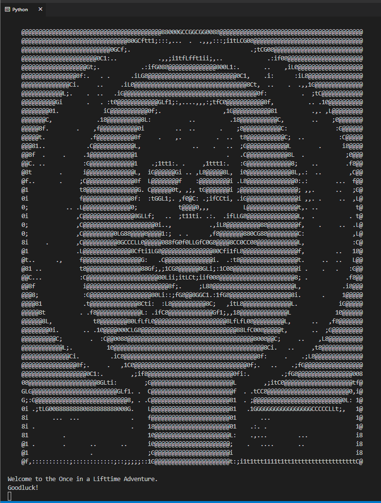
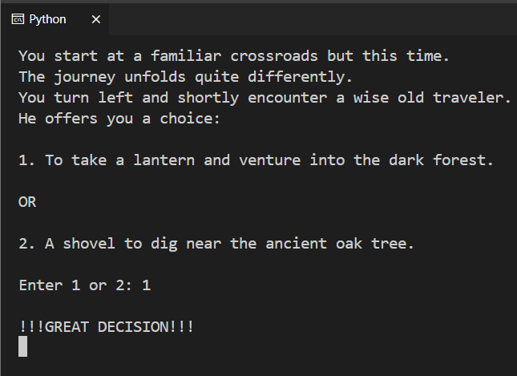
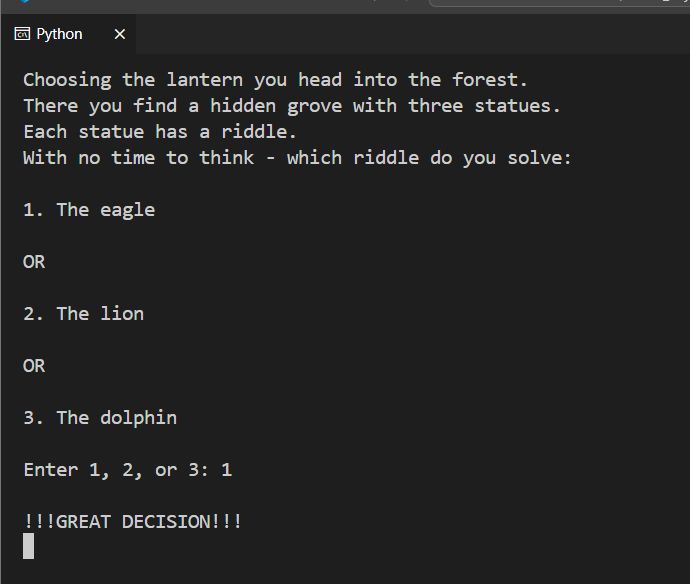
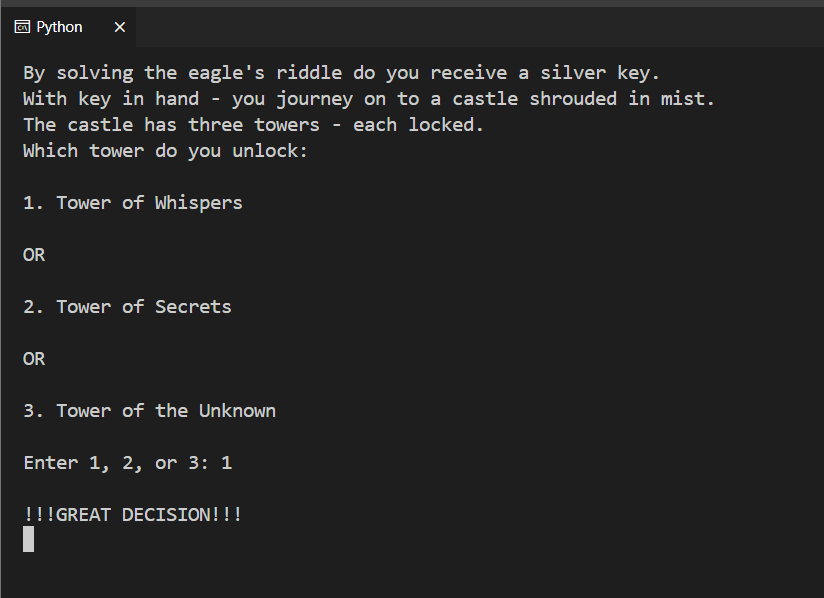
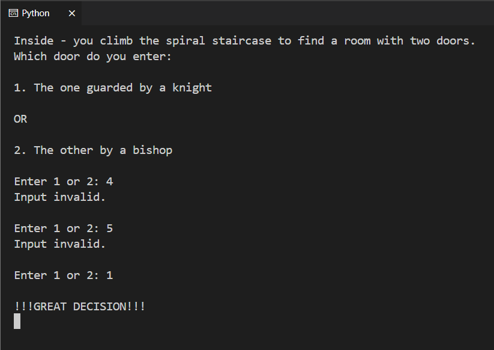
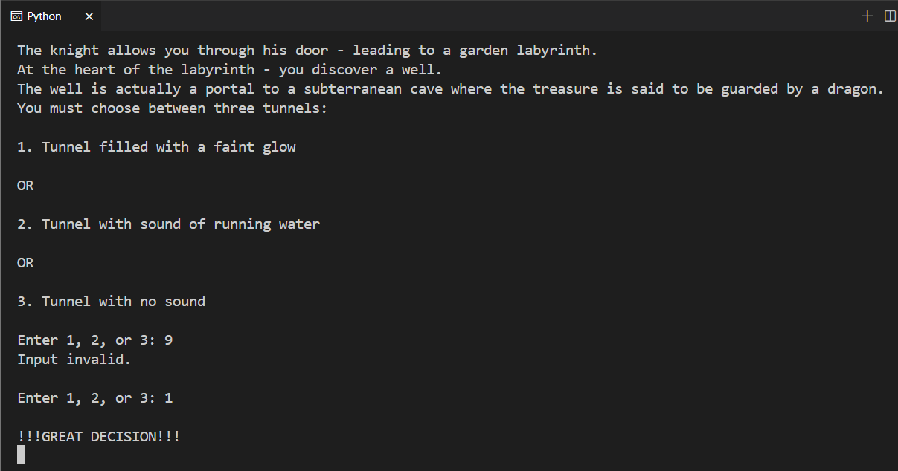
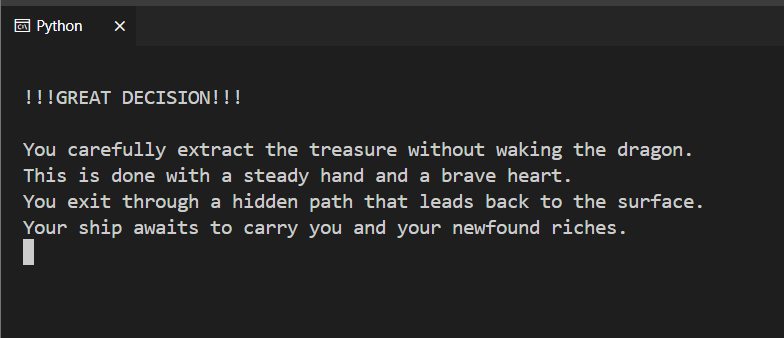

# Treasure Quest Adventure

## Introduction
Embark on a thrilling text-based adventure with this Python game. Players start at a crossroads in their search for treasure, making critical choices that determine their path.

## Features
1. Engaging narrative with multiple endings.
2. Interactive choice-driven gameplay.
3. Immersive scenarios that test decision-making skills.
   
   
   
   
   
   
   
   
   

## System Requirements
- Python 3.x

## Getting Started
To begin your quest in the Treasure Quest Adventure, follow these steps:
1. Confirm Python 3.x is installed on your machine.
2. Download the `main.py` script.
3. Open a terminal window.
4. Change directory to where the script is located.
5. Execute the script: `python main.py`
6. Make your choices as prompted on the screen.
