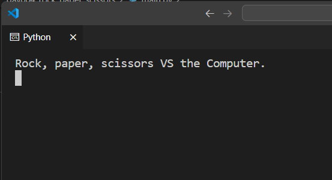
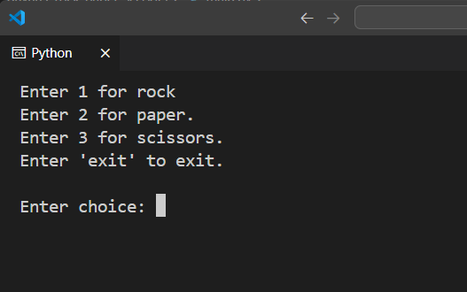
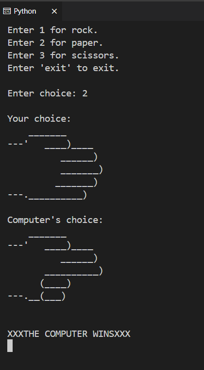
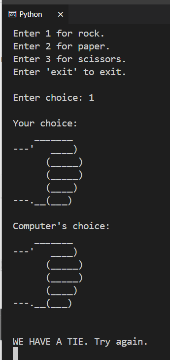
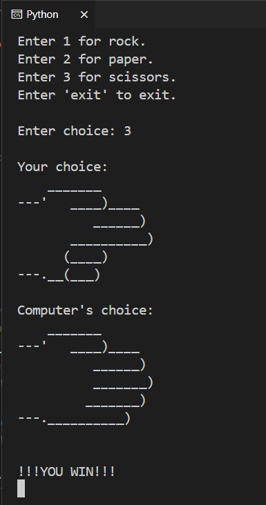
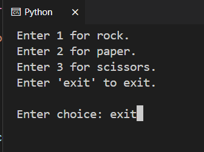

# Rock, Paper, Scissors Game

## Introduction
Classic game of Rock, Paper, Scissors with a digital twist. Compete against the computer in this simple yet engaging Python game. Test your luck and strategic thinking as you choose your weapon in an attempt to outsmart the computer.

## Features
1. Classic gameplay with a digital interface.
2. Engaging rock, paper, scissors illustrations.
3. Instant feedback on your choice vs. the computer's choice.
   
   
   
   
   
   
   
   
   
   
   
   

## System Requirements
- Python 3.x

## Getting Started
To kickstart your Rock, Paper, Scissors game, follow these steps:
1. Ensure Python 3.x is installed on your system.
2. Download the `main.py` script.
3. Open a terminal window.
4. Navigate to the directory where the script is saved.
5. Run the script: `python main.py`
6. Choose your element as prompted on the screen.
