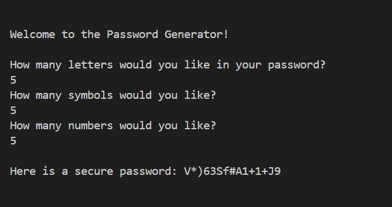

# Password Generator

## Introduction
This program adds a digital layer to the creation of secure passwords. With the ability to customize the number of letters, symbols, and numbers, this Python tool allows you to generate passwords that are both robust and unique.

## Features
1. Customizable password complexity.
2. An assortment of letters, symbols, and numbers for diverse password creation.
3. Clear and user-friendly terminal interface for smooth operation.
   
   

## System Requirements
- Python 3.x

## Getting Started
Create secure passwords by following these steps:
1. Check that Python 3.x is installed on your computer.
2. Download the `main.py` script from the provided repository.
3. Launch your terminal (or command prompt on Windows).
4. Change your directory to where you've saved the `main.py` file.
5. Start the script by typing `python main.py`.
6. Enter the desired number of letters, symbols, and numbers as prompted.
