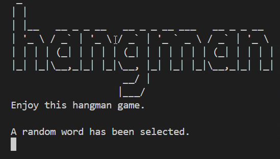
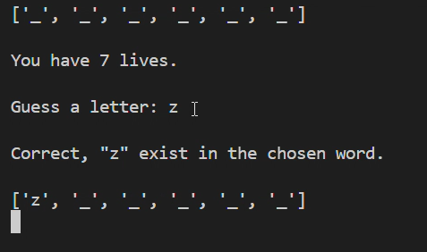
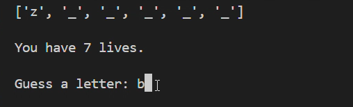
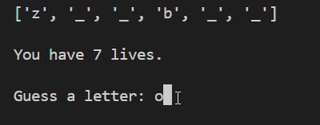
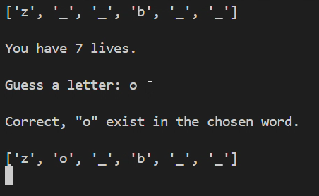
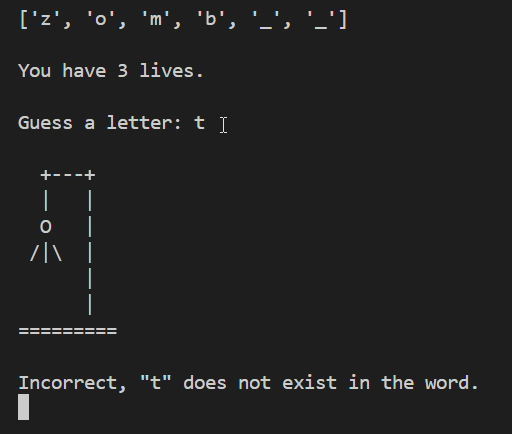
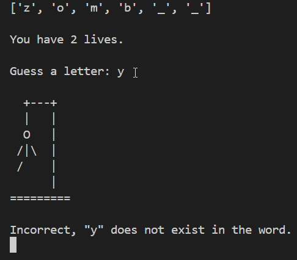
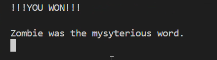

# Hangman Game

## Introduction
This is a Python-based Hangman game that challenges players to guess words letter by letter. It provides a graphical representation of the hangman and updates the player's progress with each guess.

## Features
- Interactive Hangman visualization.
- A vast list of words to guess from.
- Immediate feedback on guesses.

    

    

    

    

    

    

    

    

    

    

## System Requirements
- Python 3.x

## Getting Started
To play the Hangman game, ensure you have Python 3.x installed. Download `main.py` and `hangman_misc.py`, and follow these steps:
1. Open your terminal or command prompt.
2. Navigate to the directory containing the downloaded scripts.
3. Execute `python main.py` to start the game.
4. Follow the on-screen prompts to guess letters.