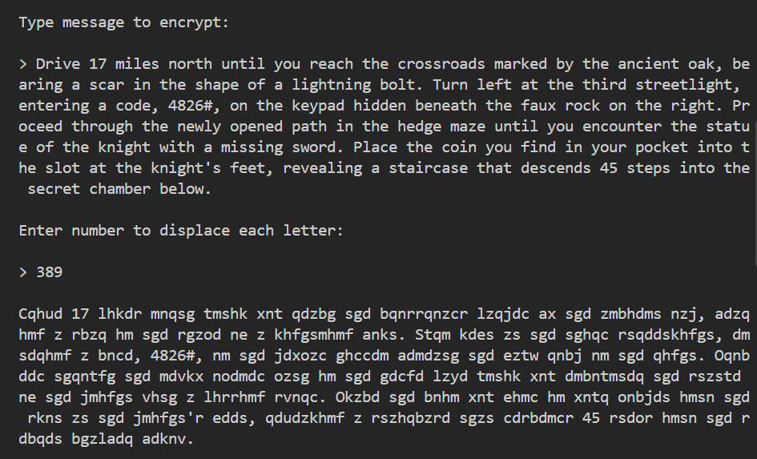
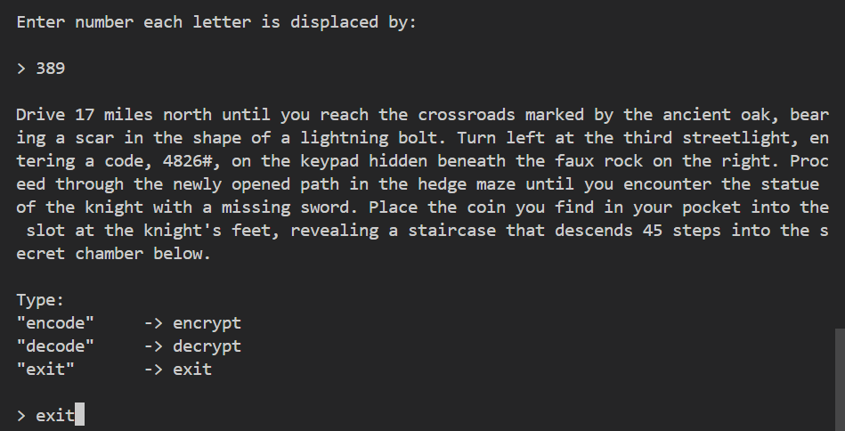

# Message Encryptor 

## Introduction
This Python script allows for encryption and decryption of messages, supporting numbers, symbols, spaces, and both upper and lower case letters. It utilizes a simple cipher technique to shift characters, providing a straightforward method to secure your messages.

## Features
- Encrypt and decrypt messages with ease.
- Supports numbers, symbols, spaces, upper and lower case letters.
- Customizable shift values for encryption and decryption.

    

    

    

    

## System Requirements
- Python 3.x

## Getting Started
1. Ensure Python 3.x is installed on your system.
2. Download `main.py`.
3. Open your terminal or command prompt.
4. Navigate to the directory containing `main.py`.
5. Execute the script by running `python main.py`.
6. Follow the on-screen instructions to encrypt or decrypt a message. Enter "exit" to stop the script.
