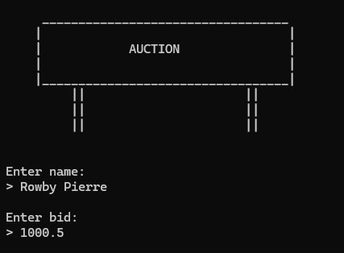
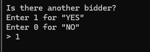
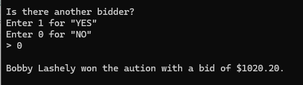

# Silent Auction System

## Introduction
This Python script facilitates the organization of a silent auction, where participants can discreetly submit their bids without knowing the amount offered by others. It's designed to accept multiple bids, track each bid along with the bidder's name, and ultimately determine the highest bid at the end of the auction. The system supports a simple interface for entering bids and deciding whether to continue accepting more bids.

## Features
- Simple and user-friendly command-line interface.
- Accepts bids in a silent auction format, where bidders do not see others' bids.
- Automatically tracks bidder names, bid amounts, and assigns a unique ID to each bid.
- Allows for rounding bid amounts to the nearest cent for precision.
- Determines the winner with the highest bid at the end of the auction.
- Utilizes a clear screen function to keep the bidding process discreet.
- Supports both Windows and Unix-based systems for screen clearing.

    

    

    

## System Requirements
- Python 3.x

## Getting Started
1. Ensure Python 3.x is installed on your system.
2. Save the script as `main.py`.
3. Open your terminal or command prompt.
4. Navigate to the directory containing `main.py`.
5. Run the script by executing `python main.py`.
6. Follow the on-screen prompts to enter bidder names and bid amounts. Respond to whether there are more bidders.
7. After the last bid is entered, the script will announce the winner with the highest bid.
