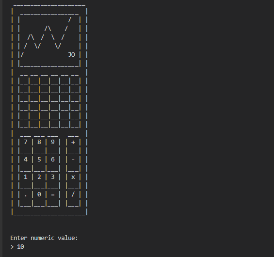
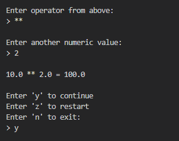
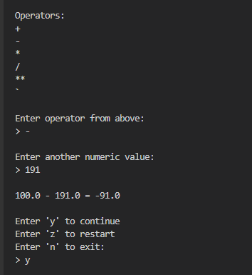
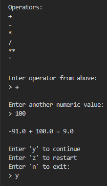
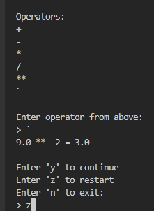

Based on the content of your Calculator script, here's a straightforward and concise README template for it:

---

# Simple Calculator Script

## Introduction
This script is a user-friendly calculator that performs basic arithmetic operations and more, including addition, subtraction, multiplication, division, exponentiation, and square root calculation. It features a command-line interface that allows users to perform continuous calculations or restart the process as needed.

## Features
- Supports basic arithmetic operations: addition, subtraction, multiplication, division.
- Advanced functions include exponentiation and square root calculations.
- Continuous calculation with the same starting number until the user decides to exit or restart.
- Simple command-line interface for easy interaction.

    

    

    

    

    

## System Requirements
- Python 3.x
- `math` library for mathematical operations
- `os` library for clearing the screen between operations

## Getting Started
1. Ensure Python 3.x is installed on your system.
2. Download the script `main.py`.
3. Open your terminal or command prompt.
4. Navigate to the directory containing `main.py`.
5. Execute the script by running `python main.py`.
6. Follow the on-screen prompts to perform calculations.

## Usage
1. Enter a numeric value when prompted.
2. Choose an arithmetic operation from the displayed options.
3. If performing square root, only the initial number is needed. For other operations, enter a second number.
4. The result will be displayed. You can choose to continue with the result, restart, or exit.

