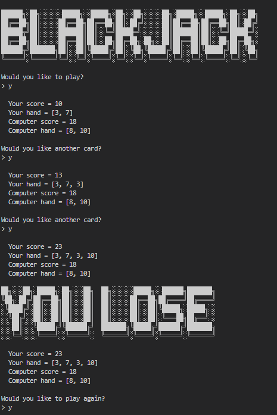
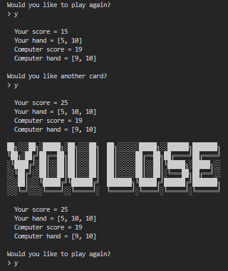
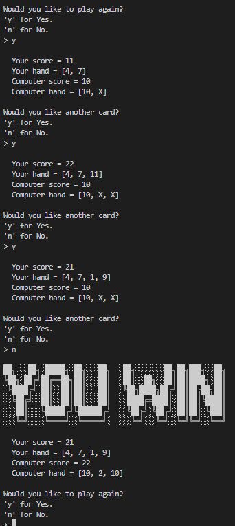
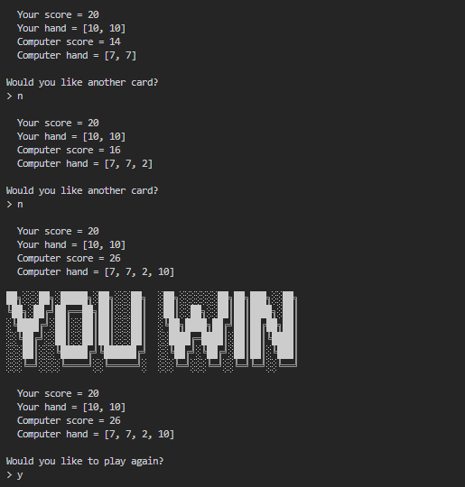

# Blackjack Game 

## Introduction
This Python script is a digital version of the classic card game Blackjack, designed to run in a command-line interface. Player can engage in a virtual blackjack game where they can draw cards, see their hand, compare with the dealer's hand, and aim for the magic number, 21, to win.

## Features
- User-friendly command-line Blackjack game.
- Players can draw cards and view their hand and the dealer's hand.
- Features a function to calculate the score of hands.
- Special checks for Blackjack conditions.
- Handling of aces as either 1 or 11
- Options to draw additional cards or hold.
- Checks for winning, losing, or tie conditions.

    

    

    

    

## System Requirements
- Python 3.x
- Access to command line or terminal

## Getting Started
1. Make sure Python 3.x is installed on your system.
2. Download `main.py` to your local machine.
3. Navigate to the downloaded script's location in the command line or terminal.
4. Run the script using the command `python main.py`.
5. Follow the on-screen instructions to play the game.

