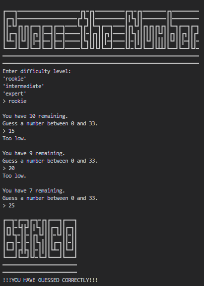
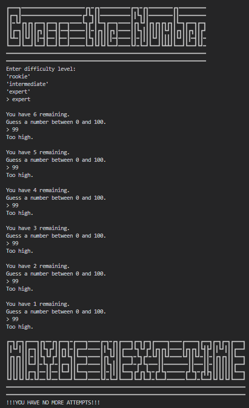

# Guess the Number Game

A simple yet engaging game where your task is to guess the correct number within a range of numbers.

## Installation

No installation required. Just download and run the `main.py` file in your favorite Python environment.

## How to Play

1. Run `main.py`.
2. Enter the difficulty level when prompted:
   - `rookie` for beginners (number range is smaller).
   - `intermediate` for a moderate challenge.
   - `expert` for a larger range of numbers and a tougher challenge.
3. You'll be given a number of attempts to guess the correct number.
4. Enter your guess when prompted.
5. The game will tell you if your guess is too high, too low, or correct.

## Screenshots

### Successful Guess

### Unsuccessful Guess

## Features

- Multiple difficulty levels to suit your skill level.
- Number range changes based on difficulty to keep the game challenging.
- Immediate feedback on your guess.
- ASCII art for visual appeal.