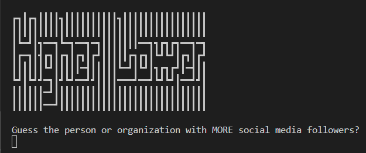
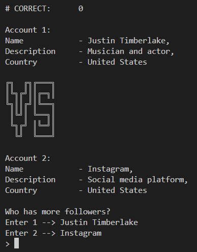
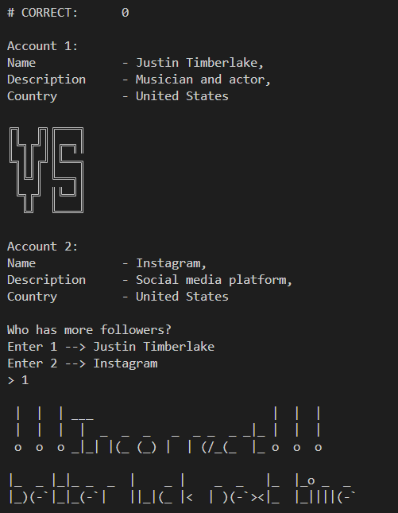

# Higher/Lower Social Media Followers Game

## Introduction
This is a Python-based command-line game that challenges players to guess which person or organization has more social media followers. It presents two accounts at a time and asks the user to choose which one has the higher follower count.

## Features
- Compare the number of followers between two social media accounts.
- Keeps track of the player's correct streak.
- Provides immediate feedback on whether the player's guess was correct.
- It can be used to understand social media dynamics and popularity.

## Screenshots

### Landing Screen

### Account Comparison 

### Incorrect Guess Feedback

### Correct Streak 

## System Requirements
- Python 3.x

## Getting Started
1. Ensure Python 3.x is installed on your system.
2. Download the script `main.py` and the supporting documents `game_data.py`, `art.py`.
3. Open your terminal or command prompt.
4. Navigate to the directory containing `main.py`.
5. Execute the script by running `python main.py`.
6. The game will start, and you can begin guessing.

## Usage
1. Once the game starts, you will see two accounts with a brief description.
2. Guess which account has more social media followers.
3. Enter the number corresponding to your guess.
4. Receive feedback on whether your guess was correct.
5. Continue playing to build up your correct streak.