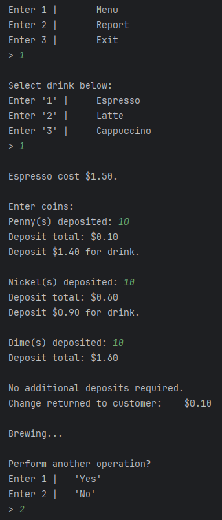
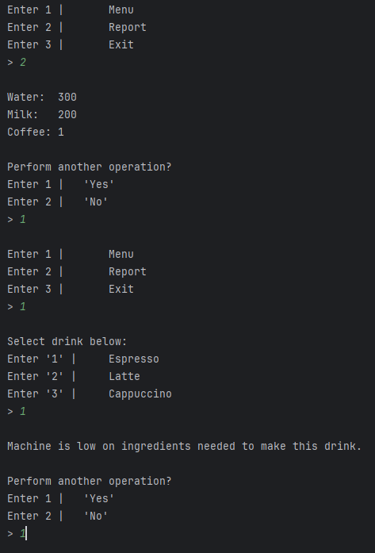

# Espresso Machine Interface

## Introduction
This command-line based program simulates an espresso machine interface, allowing users to select drinks, handle transactions, and check machine reports.

## Features
- Select from various coffee drinks like Espresso, Latte, and Cappuccino.
- Perform transactions by inserting coins.
- Check the machine's resource levels to ensure drink availability.

## Screenshots

### Transaction Process

### Resource Check

## System Requirements
- Python 3.x

## Getting Started
1. Ensure Python 3.x is installed on your system.
2. Download and execute the script `main.py`.
3. Follow the on-screen prompts to interact with the machine.

## Usage
1. Choose a drink from the menu.
2. Insert coins as required.
3. Check reports on remaining resources.
4. Repeat or exit the program as needed.
