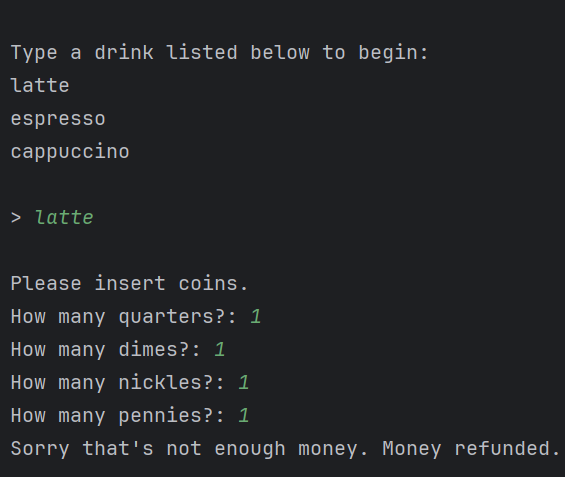
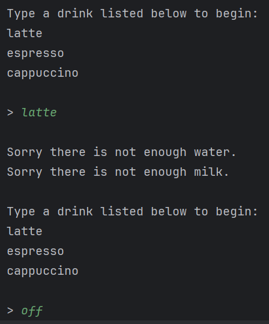
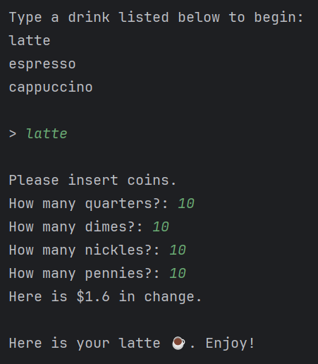
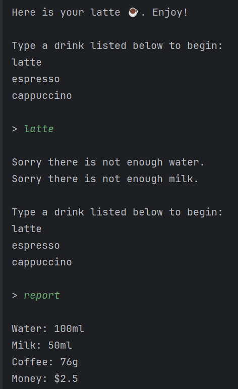

# Coffee Machine Program

## Introduction
Using object-oriented programming, this Python program simulates a coffee machine interface, where users can select drinks and handle transactions using a command-line interface. It checks for sufficient resources and handles payment before making a drink.

## Features
- Offers a selection of drinks including espresso, latte, and cappuccino.
- Checks if sufficient resources are available before making a drink.
- Handles user payments with coin insertion simulation.

## Screenshots

### Insufficient Funds

### Low Supplies

### Successful Order

### Report Screen

## System Requirements
- Python 3.x

## Getting Started
1. Ensure Python 3.x is installed on your system.
2. Download the scripts (`main.py`, `menu.py`, `money_machine.py`, and `coffee_maker.py`).
3. Run `python main.py` in your terminal to start the program.

## Usage
1. Follow the on-screen instructions to select a drink.
2. Insert the appropriate amount of coins.
3. Enjoy your coffee or retry if the resources are low or funds are insufficient.
