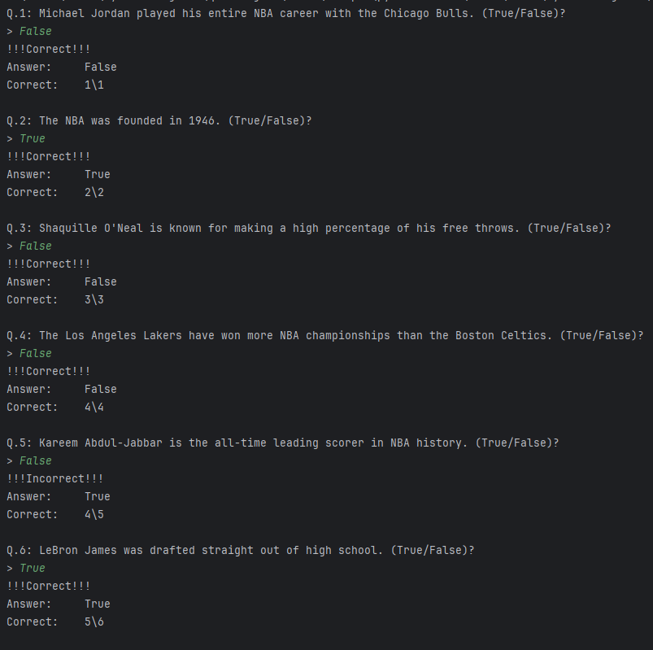
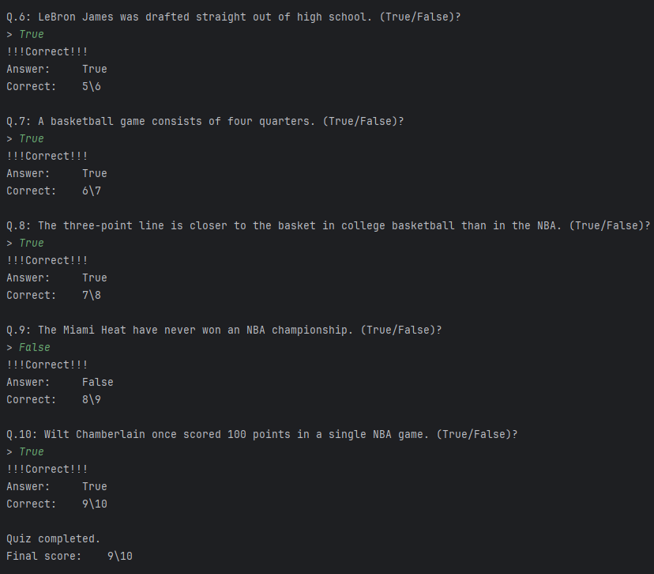

# NBA Trivia Quiz Game

Welcome to the NBA Trivia Quiz game! Test your knowledge of NBA facts with this engaging trivia game.

## Installation

To get started, you will need Python installed on your system. No additional libraries are required. Download the following files to the same directory:
- `main.py` (main executable)
- `data.py` (contains the trivia questions and answers)
- `question.py` (defines the question structure)
- `quiz.py` (handles the quiz logic)

## How to Play

1. Navigate to the directory containing the game files in your terminal or command prompt.
2. Run the command `python main.py` to start the game.
3. You will be prompted with true/false questions about NBA history. Type your answer and press enter.
4. After each question, you will immediately see if your guess was correct or incorrect and your current score.
5. The game ends after all questions are answered.

## Features

- Questions covering various aspects of NBA history.
- Immediate feedback on your answers.
- Final score presented at the end of the quiz.

## Screenshots

### Sample Questions

## Contribution

Feel free to fork the repository, and submit pull requests with your proposed changes or additional questions.

## Lastly

Enjoy testing your NBA knowledge!
