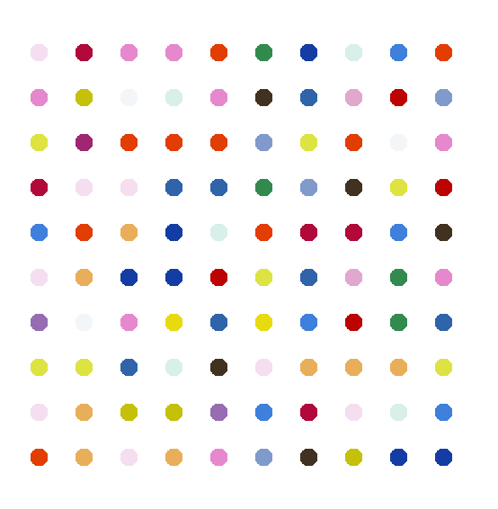
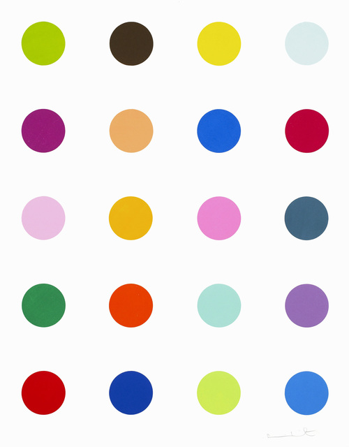

# Hirst Inspired Digital Dots

This project showcases an interactive animation inspired by the vibrant dot artworks of Damien Hirst, featuring a 100-dot matrix (10x10 grid).

### Prerequisites

What you need to run this software:
- Python (version 3.x recommended)

## Usage

To run the main program:
```
python main.py
```

This will activate the animation, displaying a grid of 100 interactive dots.



## Demo
 
Follow/ click: [`LINK`](https://www.dropbox.com/scl/fi/o535layws8mi3smva3i8v/python_bot_dots_art.mp4?rlkey=5rr7lzqi3lnrzy64mfoxy624f&st=eow0bbyu&dl=0).


## Features

- **Interactive Dot Matrix**: A 10x10 grid of colored dots that users can interact with.
- **Inspired by Damien Hirst**: The design mimics the famous dot artworks by Damien Hirst, adapted into an interactive digital format.
- **User Interaction**: Users can have local machine create the artwork in real-time.

## Contributing

We welcome contributions to this project. 

## Acknowledgments

- Inspired by the artwork of Damien Hirst.

- 

