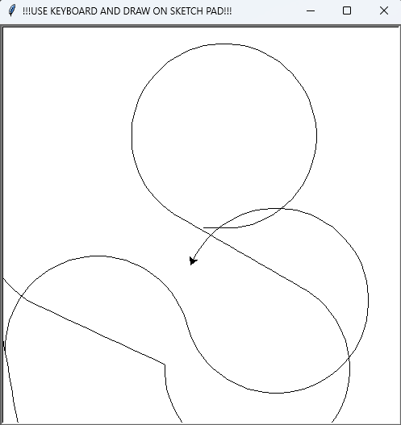

# Python Keyboard Sketch Pad

Create intricate designs using simple keyboard controls with this Python Keyboard Sketch Pad. This interactive drawing tool allows you to navigate a cursor on a canvas to sketch freeform shapes and patterns.

## Getting Started

Ensure you have Python installed on your system. The project uses the built-in Turtle graphics library, so no additional installations are necessary.

### Installation

1. Download the `main.py` file to your local machine.
2. No additional Python packages are required as it uses the standard Turtle graphics library.

## How to Use

1. Run the script by navigating to the folder containing `main.py` and typing in your terminal or command prompt:
   ```
   python main.py
   ```
2. Once the program starts, use the following keyboard keys to control the sketch cursor:
   - `W`: Move forward
   - `S`: Move back
   - `A`: Turn left
   - `D`: Turn right
   - `Q`: Move left diagonally
   - `E`: Move right diagonally
   - `Z`: Reset the canvas
   - `Space`: Close the canvas

## Program Interface



## Demo

See the program in action in this demo video: [Watch the demo](https://www.dropbox.com/scl/fi/ne29cxey23wjmwtbg5amt/python_keyboard_sketch_pad.mp4?rlkey=xskevam73q2mwoxuv9wixlbhc&st=bhbi0jqa&dl=0).

## Contributing

Feel free to fork the repository and submit pull requests if you have suggestions for improvements or new features.
