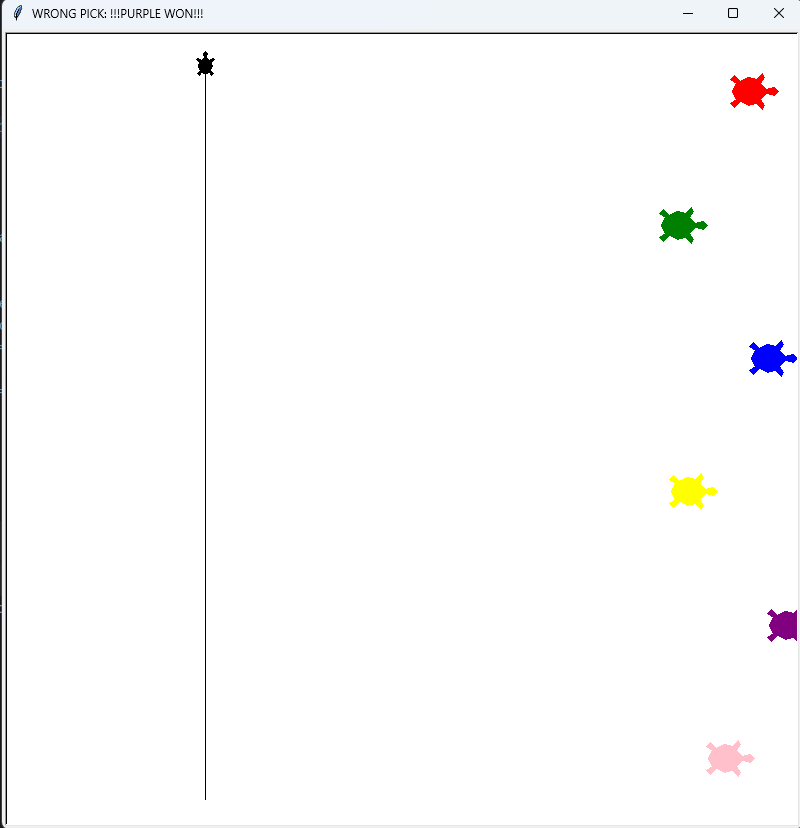

# Python Turtle Racing Game

Welcome to the Python Turtle Racing Game! This engaging game uses the Python Turtle graphics library to simulate a race among colored turtles. Players pick their winner before the race starts, and watch as the turtles compete to reach the finish line.

## Getting Started

To run this game, ensure you have Python installed on your system along with the Turtle graphics library.

### Prerequisites

- Python (3.x recommended)
- Turtle graphics library (usually included with Python standard library)

### Installation

1. Download the `main.py` file to your local machine.
2. Ensure you have Python and Turtle graphics installed.

## How to Play

Run the game by opening a terminal or command prompt, navigating to the folder containing `main.py`, and typing:
```
python main.py
```
You will be prompted to choose a turtle you think will win the race. After making your selection, watch the race unfold!

## Game Interface



## Demo

Watch a full demo of the game [here](https://www.dropbox.com/scl/fi/b6zx1eb5m55403ix51r60/python_racing_turtle_animation.mp4?rlkey=zrhgfzsjpruj2ftp68ku0ctt6&st=kd1ioz8g&dl=0) to see how it works and get a feel for the gameplay.

## Contributing

If you would like to contribute to this project or suggest improvements, please fork the repository and submit a pull request.
