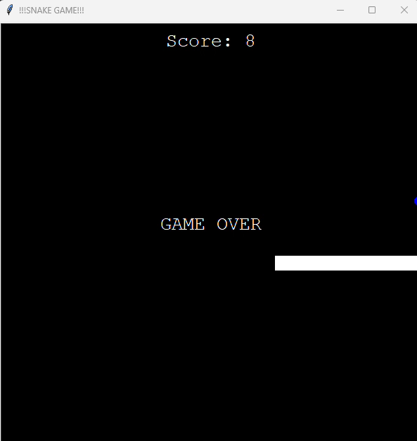

# Python Nokia Snake Game

Classic Nokia Snake game recreated in Python. Navigate the snake to eat food and grow while avoiding collisions with yourself and the walls. See how high you can score!

## Getting Started

To run this game, make sure you have Python installed on your system. The game consists of several Python scripts that handle different aspects of the gameplay.

### Prerequisites

- Python (3.x recommended)
- No external libraries are required

### Installation

1. Download the following Python files to your local machine:
   - `main.py` (Main game loop)
   - `snake.py` (Snake mechanics)
   - `food.py` (Food mechanics)
   - `scoreboard.py` (Score tracking)
2. Ensure you are in the directory containing these files.

## How to Play

Open your command line interface and run:
```
python main.py
```
Control the snake using the keyboard arrows. Try to eat as much food as possible without colliding with the snake's own body.

## Game Screenshots

### In-Game Score


### Game Over


## Demo

Watch a full demo of the game [here](https://www.dropbox.com/scl/fi/nuki2d8u00av173t63oox/python_nokia_snake_game.mp4?rlkey=gxxo9qux1g4bpj2ijs1j2yxue&st=lkkw3jom&dl=0) to see how it plays and explore its features.

Enjoy the nostalgia and happy gaming!