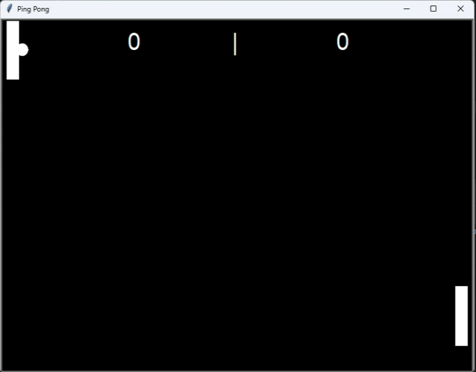
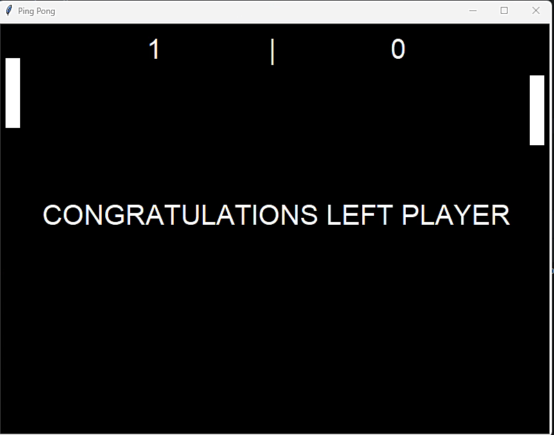

# Python Ping Pong Game

Challenge a friend to Python Ping Pong game.

## Getting Started

Ensure you have Python installed on your computer to run this game. 

### Prerequisites

- Python (3.x recommended)

### Installation

1. Download the game files to your local machine:
   - `main.py` (Main game controller)
   - `ball.py` (Ball dynamics)
   - `paddle.py` (Paddle controls)
   - `scoreboard.py` (Score keeping)
2. Navigate to the directory containing these files.

## How to Play

To start the game, open your terminal and run:
```
python main.py
```
Control the left paddle using the 'W' and 'S' keys for up and down movements, respectively. Control the right paddle using the 'Up arrow' and 'Down arrow' keys for up and down movements, respectively. 

## Game Screenshots

### Game Start


### Game End


## Demo

Watch the game in action and see how you can enjoy playing it with friends [here](https://www.dropbox.com/scl/fi/zzijuyncxqzm5jzhltl3e/python_ping_pong_game.mp4?rlkey=cvb93nnp3jt9zfhcr2nk913y1&st=jj1r8li5&dl=0).

## Contributing

If you're interested in improving the game or adding new features, please fork the repository and submit a pull request. We welcome all contributions!
