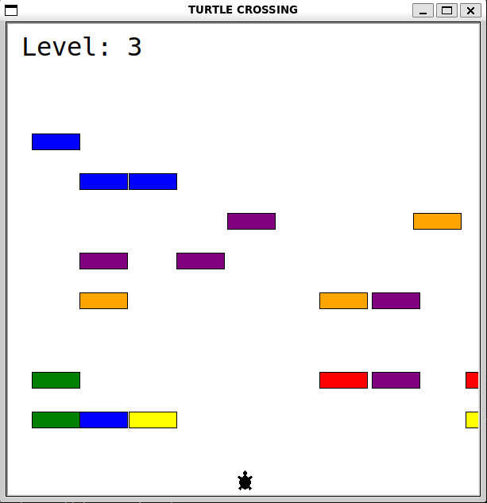
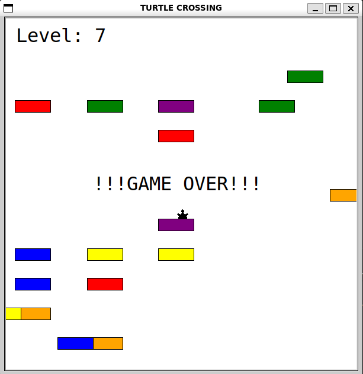

# 🐢 Turtle Crossing Game

A simple Python game built using the `turtle` graphics library.  
The player controls a turtle trying to cross a busy road without getting hit by cars.

| Game Running |  Game Over |
|:------------:|:-----------:|
| | 

## 🎮 How to Play
- Use the **Up Arrow** key to move the turtle upward.  
- Avoid the moving cars.  
- Reach the top of the screen to level up!  
- The game ends if a car hits the turtle.

## 🧱 Project Structure
```
day023_turtle_crossing_game_oop/
│
├── main.py          # Runs the game
├── player.py        # Player (turtle) logic
├── car_manager.py   # Handles car creation and movement
└── screen.py        # Game screen and display logic
```

## ▶️ Run the Game
```bash
python3 main.py
```

## 📦 Requirements
- Python 3.x  
- turtle (built-in)
