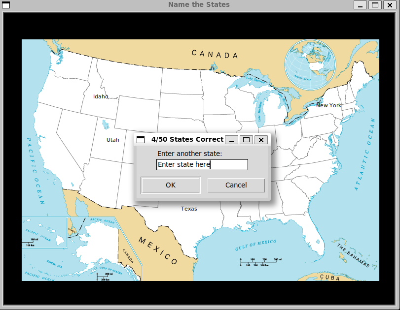

# 🗺️ Name the States Game

## 📘 Description
This is a fun Python quiz game that challenges you to name all 50 U.S. states.  
Each time you guess a state correctly, its name appears on the map at the correct location.


---

## 🧰 Requirements
Make sure you have:
- **Python 3** installed  
- The following Python libraries:
  ```bash
  pip install pandas
  ```
- The files:
  - `blank_states_img.gif` (map image)
  - `50_states.csv` (contains state names and coordinates)

---

## ▶️ How to Run
1. Place all files in the same folder:
   ```
   name_the_states/
   ├── main.py
   ├── blank_states_img.gif
   └── 50_states.csv
   ```
2. Run the game:
   ```bash
   python main.py
   ```
3. A map window will open. Type the name of a state in the popup box and press **OK**.

---

## 🎯 Gameplay
- Each correct answer displays the state’s name on the map.  
- The title updates to show how many states you’ve guessed correctly (e.g., “4/50 States Correct”).  
- The game continues until all 50 states are named.

---

## 🧾 Notes
- The CSV file must contain columns:  
  ```
  state, x, y
  ```
  where `x` and `y` are coordinates on the map image.  
- You can close the game window anytime to exit.
