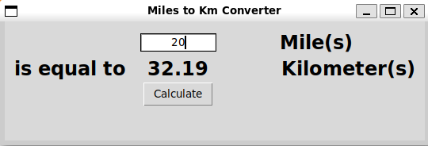

# 🚗 Miles to Kilometers Converter

## 📘 Description

A simple Python GUI app that converts **miles** to **kilometers** using the `tkinter` library.
You enter a number of miles, click **Calculate**, and the equivalent distance in kilometers appears.


---

## 🧰 Requirements

Make sure you have:

* **Python 3** installed
* No extra libraries required — `tkinter` comes with Python by default.

---

## ▶️ How to Run

1. Save the script as **main.py**
2. Run it in your terminal or IDE:

   ```bash
   python main.py
   ```
3. A small window will open where you can:

   * Enter miles in the input box
   * Click **Calculate** to see the result in kilometers

---

## 🎯 Example

```
Miles: 5
Kilometers: 8.05
```

---

## ⚙️ Formula

The app uses the conversion formula:

```
1 mile = 1.60934 kilometers
```

---

## 🪟 GUI Features

* Clean layout using **tkinter grid** system
* Labels and buttons styled with **Arial, 18, bold** font
* Displays the converted value rounded to **2 decimal places**

---

## 🏁 Exit

Close the window to end the program.
