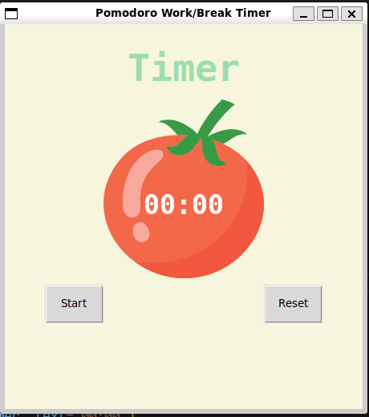
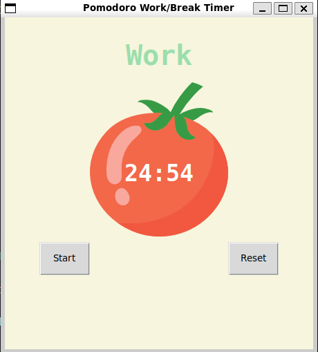
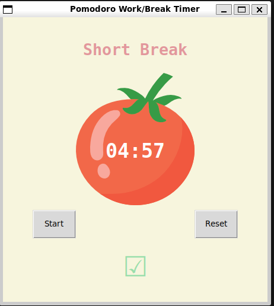

# Pomodoro Timer

Tkinter timer for work/break cycles.





## Features
- Work, short & long breaks
- Start/Reset buttons
- Checkmarks for completed sessions

## Requirements
- Python 3
- tkinter
- `tomato.png` in script folder

## Usage
```bash
python pomodoro.py
````

## Constants

* `WORK_MIN=25`, `SHORT_BREAK_MIN=5`, `LONG_BREAK_MIN=20`
* `final_round=8`

## Functions

* `start_timer(min)` — begin session
* `reset_timer()` — reset timer/checks
* `timer(max_secs)` — countdown
* `timer_fomat(x)` — format time

