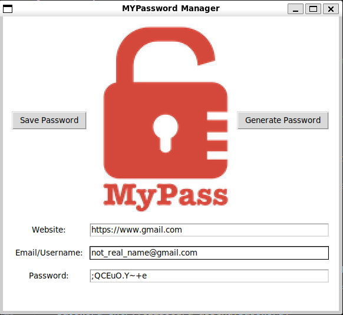
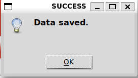
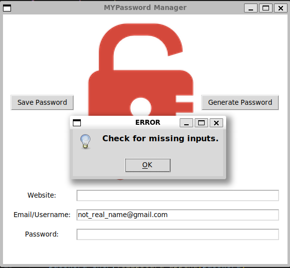

# MYPassword Manager

A small Tkinter app that lets you **generate passwords** and **save login data** (website, username, password) to `data.json`.




## Features

* Generate random passwords (letters, digits, symbols).
* Auto-copy password to clipboard.
* Save login info to `data.json`.
* Updates existing entries if the website already exists.
* Simple GUI built with Tkinter.

## How It Works

1. Type a website and username.
2. Click **Generate Password** or type your own.
3. Click **Save Password**.
4. Your data is written to `data.json` in this format:

```json
{
  "example.com": {
    "Username": "user@example.com",
    "Password": "mypassword123"
  }
}
```

## Files Used

* **data.json** – stores saved logins.
* **logo.png** – shown in the window and taskbar.

## Requirements

Standard Python libraries only:

* json
* os
* random
* string
* tkinter

No external installs needed.

## Run the App

```bash
python main.py
```

## Notes

* Fields must not be empty or the app shows an error.
* Password length is between 10–20 characters.
* The logo image must be named `logo.png` and be in the project folder.