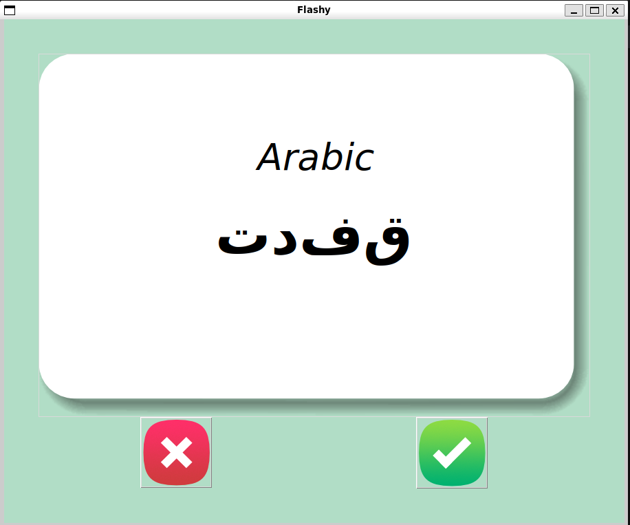
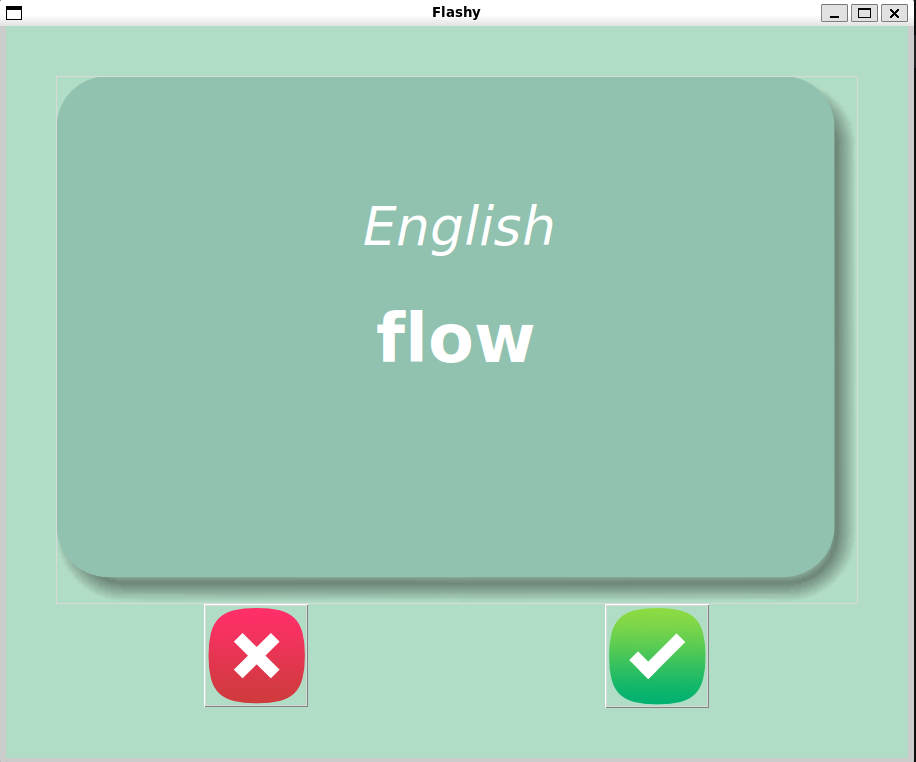

# Flashy – Arabic Flashcards

A simple Tkinter app for studying [Arabic words](https://strommeninc.com/arabic-frequency-vocabulary-the-1000-most-common-arabic-words-you-need-to-know/) with front/back flashcards.

## Features

* Shows Arabic → flip to see English
* Click left button = **wrong** (keep word)
* Click right button = **right** (remove word)
* Saves progress to `study_words_flashy.csv`
* Loads images from your project’s `images/` folder
* Uses NFC normalization for Arabic text

## How It Works

* `get_fullpath()` finds files in the project
* `get_arabic_word()` shows a new Arabic word
* Click card → `show_english_word()` shows translation
* `save_progress()` writes remaining words to CSV
* `window.mainloop()` keeps the window open

## Requirements

```
python3
tkinter
pandas
```

## Run

```
python main.py
```

## File Structure (example)

```
project/
│ main.py
│ arabic_wordlist_1k.csv
└─ data/
     study_words_flashy.csv
└─ images/
     flashcard_front.png
     flashcard_back.png
     gui_card_front.png
     gui_card_back.png
     wrong_button.png
     right_button.png
```

## Demo

Front card example:


Back card example:

