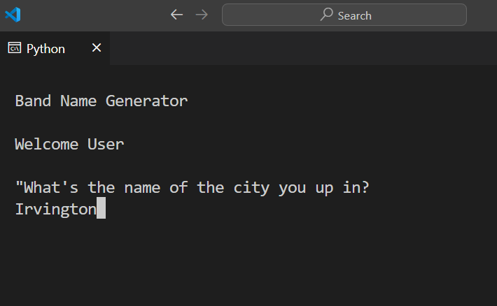
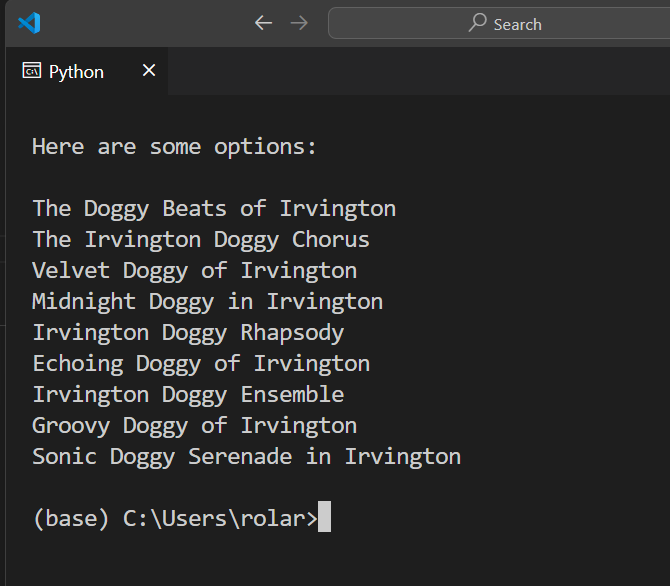

# Band Name Generator

## Introduction
The Band Name Generator is a simple Python script that generates creative band names using a combination of a pet name and a city name provided by the user.

## How to Use
1. Run the script in a Python-enabled terminal.
2. When prompted, enter the name of the city you grew up in.
   
4. Next, enter a great pet name when prompted.
    
6. The script will then present you with a list of potential band names based on your input.
   

## Features
- Cross-platform compatibility: Clears the terminal window on both Windows and Unix systems.
- Personalized band name suggestions: Combines your input into unique band names.

## System Requirements
- Python 3.x

## Getting Started
To get started with the Band Name Generator, follow these steps:
1. Ensure Python 3.x is installed on your system.
2. Download the script `band_name_gen.py`.
3. Open your terminal or command prompt.
4. Navigate to the directory where the script is located.
5. Run the script using the command `python band_name_gen.py`.
6. Follow the on-screen prompts.
