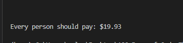

# Bill Splitter

## Introduction
This simple Python script allows users to easily split a bill among a group. It handles user inputs for the total bill amount, the desired tip percentage, and the number of people splitting the bill, then calculates and displays how much each person should pay.

## Features
1. Supports custom tip percentages.
2. User-friendly prompts guide the process.
    
3. Clear and concise output of each person's payment share.
    

## System Requirements
- Python 3.x

## Getting Started
To get started with the Band Name Generator, follow these steps:
1. Ensure Python 3.x is installed on your system.
2. Download the `bill_split.py` script.
3. Open a terminal.
4. Navigate to the script's directory.
5. Run the script: `python bill_split.py`
6. Follow the on-screen prompts.
